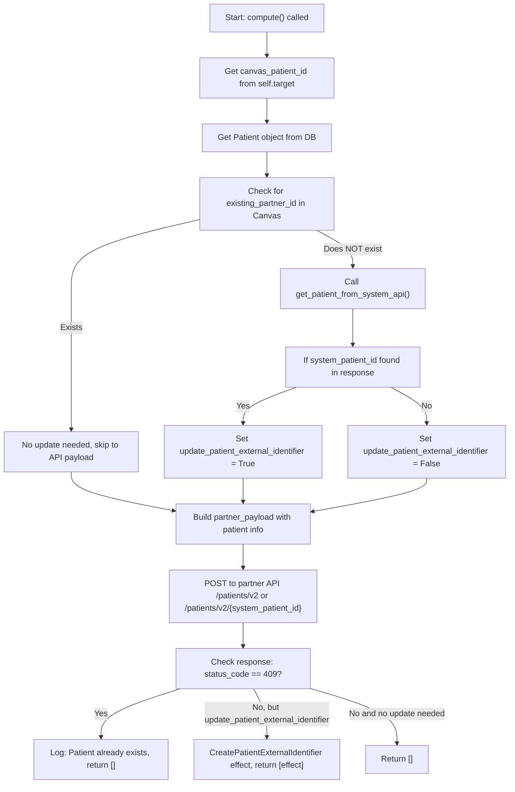

example_patient_sync
==========================

## Description

An example of bidirectional patient creation between Canvas and a 3rd party system.

At a high level, this plugin:
1. Adds an API endpoint to which the external system can POST a new patient object, which returns a patient creation request.
2. Adds an event listener on the PATIENT_CREATED event, which will ensure that when a patient is created in Canvas, that patient is also created and/or updated (with a Canvas ID) using the external system's API methods for patient GET/POST/PATCH.

## Patient Sync Flowchart

